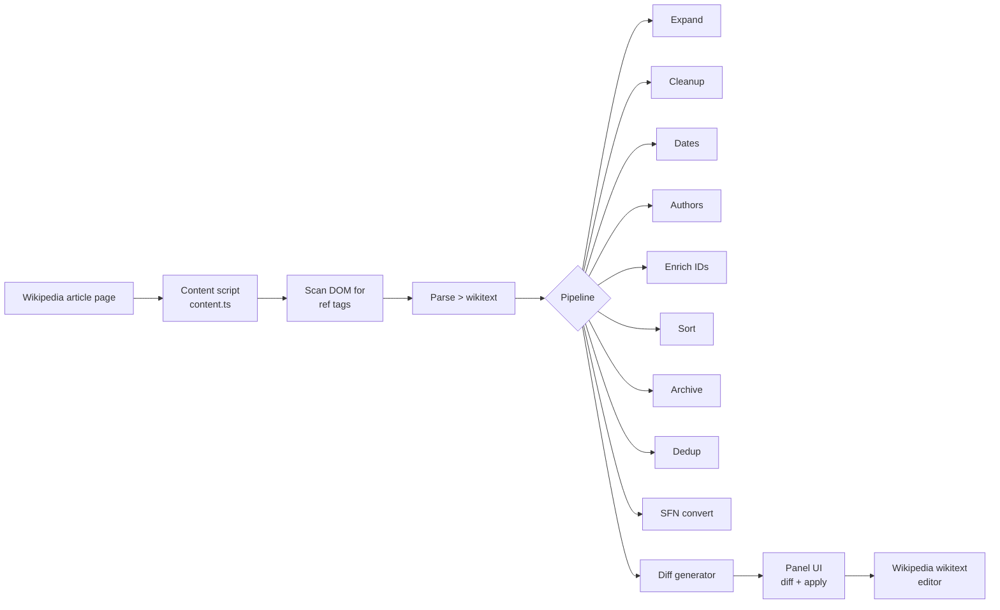
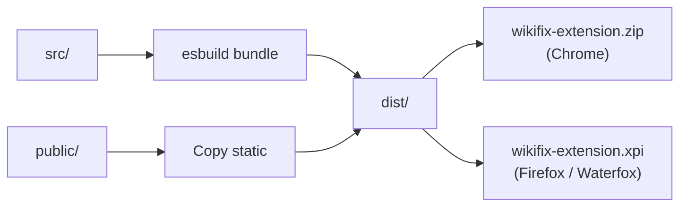

[](LICENSE)
[](tsconfig.json)
[](build.mjs)
[](https://vitest.dev)
[](public/manifest.json)
[](public/manifest.json)

# WikiCitationExtension

A browser extension that finds, cleans, and enriches citations on Wikipedia pages.

The extension runs as a content script on Wikipedia article pages. It scans the page for `<ref>` tags containing `{{cite ...}}` templates, passes them through a configurable pipeline of processing modules, and displays a diff panel for each citation. The user can then apply the changes back to the page's wikitext editor.

---

## Features

### Citation pipeline (9 modules)

| Module | Description |
|---|---|
| Expand | Fills missing fields (title, journal, date) from DOI, PMID, arXiv, ISBN via external APIs |
| Cleanup | Fixes typos, deprecated parameters, invalid ISBNs, empty values |
| Dates | Normalizes dates to Wikipedia standard (DD Month YYYY) |
| Authors | Converts between Vancouver and normal author style; optionally enriches names from external APIs |
| Enrich IDs | Fetches PMID, PMC, S2CID, QID from DOI; does not overwrite existing fields by default |
| Sort | Reorders parameters to the Wikipedia citation parameter order |
| Archive | Adds or validates Wayback Machine archive links |
| Dedup | Flags duplicate citations by matching DOI or PMID |
| SFN | Converts inline `<ref>{{cite ...}}</ref>` to `{{sfn}}` short footnote format |

Each module can be toggled individually from the extension popup.

### Spacing presets

Three citation formatting modes, or no change to preserve the original:

- **Wide** — ` | param = value`
- **Standard** — Wikipedia convention ( `| param = value` )
- **Compact** — `|param=value`

### API key configuration

Optional API keys can be set in the popup for higher rate limits:

| Service | Without key | With key |
|---|---|---|
| CrossRef | Polite pool | Priority pool (via email) |
| NCBI / PubMed | 3 req/s | 10 req/s |
| Semantic Scholar | ~1 req/s | 10 req/s |

---

## Architecture



### Build output



---

## Files

```
WikiCitationExtension/
  src/
    content.ts         # Main content script — DOM scanning, pipeline orchestration, panel UI
    popup.ts           # Extension popup — module toggles, settings, API key input
    popup.html         # Popup markup
    popup.css          # Popup styles
    background.ts      # Service worker (MV3 requirement, minimal)
    browser.d.ts       # Type declarations for browser.* APIs
    lib/
      api.ts           # External API clients (CrossRef, NCBI, Semantic Scholar, arXiv, etc.)
      authors.ts       # Author name conversion (Vancouver <-> normal)
      cache.ts         # In-memory response cache
      cleanup.ts       # Citation cleanup rules
      dates.ts         # Date normalization
      diff.ts          # Diff generation between original and fixed citation
      expand.ts        # Field expansion from identifiers
      sfn.ts           # {{sfn}} short footnote conversion
      spacing.ts       # Parameter spacing normalization
      types.ts         # Shared type definitions
      wikitext.ts      # Wikitext parsing, rendering, ref name management
  public/
    manifest.json      # Extension manifest (MV3, Chrome + Firefox)
    icon.svg           # Extension icon
    browser-polyfill.js # WebExtension browser API polyfill
  tests/               # Vitest test suite (~13 test files)
    api.test.ts
    archive.test.ts
    authors.test.ts
    cache.test.ts
    cleanup.test.ts
    content.test.ts
    dates.test.ts
    diff.test.ts
    expand.test.ts
    shared.test.ts
    spacing.test.ts
    texts.test.ts
    wikitext.test.ts
    fixtures/          # Test fixture data
  build.mjs            # esbuild bundler + zip/xpi packaging script
  package.json
  tsconfig.json
  vitest.config.ts
```

---

## Development

### Prerequisites

- Node.js 18+
- npm

### Setup

```bash
npm install
```

### Build

```bash
npm run build
```

Generates `dist/` with bundled scripts, plus `wikifix-extension.zip` (Chrome) and `wikifix-extension.xpi` (Firefox / Waterfox) at the project root.

### Watch mode

```bash
npm run watch
```

### Test

```bash
npm test          # single run
npm run test:watch  # watch mode
```

### CI check

```bash
npm run ci        # build + test
```

---

## Installation (development)

### Chrome

1. Run `npm run build`
2. Open `chrome://extensions`
3. Enable Developer mode
4. Click "Load unpacked" and select the `dist/` directory

### Firefox / Waterfox

1. Run `npm run build`
2. Open `about:debugging#/runtime/this-firefox`
3. Click "Load Temporary Add-on" and select `wikifix-extension.xpi`

For permanent installation, sign the `.xpi` through Mozilla Add-ons.

---

## External API dependencies

The extension makes read-only requests to:

- [CrossRef REST API](https://api.crossref.org) — metadata lookup by DOI
- [NCBI E-utilities](https://eutils.ncbi.nlm.nih.gov) — PubMed article metadata
- [Semantic Scholar API](https://api.semanticscholar.org) — paper metadata and citation graph
- [arXiv API](https://export.arxiv.org) — arXiv paper metadata
- [OpenLibrary API](https://openlibrary.org) — ISBN book metadata
- [EuropePMC API](https://www.ebi.ac.uk/europepmc) — article metadata
- [OpenAlex API](https://api.openalex.org) — DOI metadata
- [Wayback Machine API](https://archive.org/wayback) — archive link checking and creation

All requests are made from the browser on behalf of the user's session on Wikipedia.

---

## License

MIT — see [LICENSE](LICENSE).
