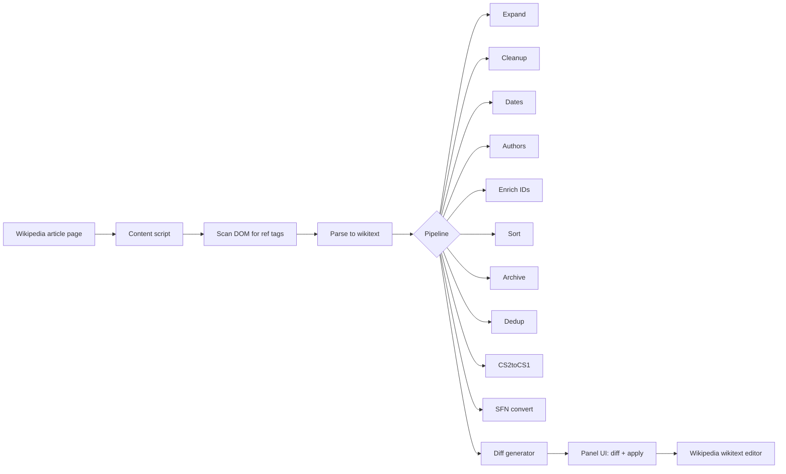
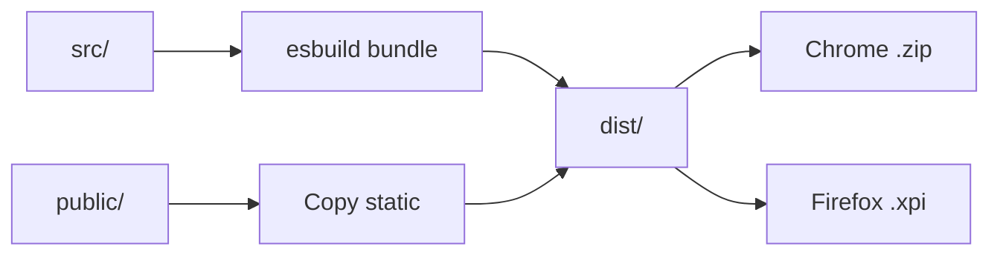

[](LICENSE)
[](https://github.com/Wolren/WikiCitationExtension/commits)
[](https://github.com/Wolren/WikiCitationExtension/issues)
[](https://github.com/Wolren/WikiCitationExtension)
[](tsconfig.json)
[](build.mjs)
[](https://vitest.dev)
[](public/manifest.json)
[](public/manifest.json)

# WikiCitationExtension

A browser extension that finds, cleans, and enriches citations on English Wikipedia pages.

New citations on Wikipedia are often incomplete or use deprecated parameters. Cleaning them manually is slow and error-prone. This extension automates the process by scanning the article page, running a configurable pipeline of processing modules over each citation, and letting the user apply changes back to the wikitext editor.

---

## How it works

The extension runs as a content script on English Wikipedia article pages. It scans the DOM for `<ref>` tags containing `{{cite ...}}` templates, parses them to wikitext, passes each citation through the pipeline, and displays a diff panel.



---

## Features

### Citation pipeline (10 modules)

| Module | Description |
|---|---|
| Expand | Fills missing fields (title, journal, date) from DOI, PMID, arXiv, ISBN via external APIs |
| Cleanup | Fixes typos, deprecated parameters, invalid ISBNs, empty values; normalizes whitespace; splits Vancouver-style comma names; resolves CS1 parameter conflicts |
| Dates | Normalizes dates to Wikipedia standard (DD Month YYYY) |
| Authors | Converts between Vancouver and normal author style; optionally enriches names from external APIs |
| CS2toCS1 | Converts `{{citation}}` to its detected template type (`cite journal`, `cite web`, etc.) |
| Enrich IDs | Fetches PMID, PMC, S2CID, QID from DOI; does not overwrite existing fields |
| Sort | Reorders parameters to the Wikipedia citation parameter order |
| Archive | Adds or validates Wayback Machine archive links |
| Dedup | Flags duplicate citations by matching DOI or PMID |
| SFN | Converts inline `<ref>{{cite ...}}</ref>` to `{{sfn}}` short footnotes |

Each module can be toggled individually from the extension popup.

### CS1 error prevention

The cleanup module addresses common CS1 errors that Wikipedia's Lua module flags:

| CS1 error | What the extension does |
|---|---|
| More than one of `location` and `place` | `place` is removed when `location` exists |
| More than one of `work` and `website` | `work` is renamed to `website` for `cite web` |
| More than one of author-name-list parameters | `vauthors` is removed when `last` exists; Vancouver mode strips `last`/`first` when creating `vauthors` |
| Vancouver style: name in name N | Comma in `last` field (e.g. `last1=Kretschmer, Ernst`) is split into `last1=Kretschmer` + `first1=Ernst` |
| Both `year` and `date` | `year` is removed when `date` exists |

### Template-aware parameter mapping

`work` is mapped to the canonical field per template:

| Template | `work` becomes |
|---|---|
| `cite web` | `website` |
| `cite news` | `newspaper` |
| `cite journal` | `journal` |
| `cite magazine` | `magazine` |
| `cite techreport` / `cite patent` | left as `work` |

`number` is mapped to `issue` only for periodical templates (`cite journal`, `cite magazine`, `cite news`).

### Spacing presets

| Mode | Format |
|---|---|
| Wide | ` | param = value` |
| Standard | `| param = value` |
| Compact | `|param=value` |

Whitespace normalization is applied by default (tabs to spaces, excess spaces collapsed).

### API key configuration

Optional API keys for higher rate limits:

| Service | Without key | With key |
|---|---|---|
| CrossRef | Polite pool | Priority pool (via email) |
| NCBI / PubMed | 3 req/s | 10 req/s |
| Semantic Scholar | ~1 req/s | 10 req/s |

---

## Build pipeline



---

## Installation (development)

### Chrome

1. `npm run build`
2. Open `chrome://extensions`
3. Enable Developer mode
4. Click "Load unpacked" and select the `dist/` directory

### Firefox / Waterfox

1. `npm run build`
2. Open `about:debugging#/runtime/this-firefox`
3. Click "Load Temporary Add-on" and select `wikifix-extension.xpi`

For permanent installation, sign the `.xpi` through Mozilla Add-ons.

### Prebuilt releases

Download the latest `.zip` (Chrome) and `.xpi` (Firefox) from the [releases page](https://github.com/Wolren/WikiCitationExtension/releases).

---

## Verification

A diagnostic tool validates extension output against both local parameter checks and the live Wikipedia parse API:

```bash
npx tsx tools/diagnose-cs1-errors.ts "Article Title" --local
npx tsx tools/diagnose-cs1-errors.ts "Article Title"
```

---

## Tech stack

| Tool | Purpose |
|---|---|
| TypeScript | Application language |
| esbuild | Bundler |
| Vitest | Test runner |
| jsdom | Test environment |

---

## External API dependencies

The extension makes read-only requests to:

- [CrossRef REST API](https://api.crossref.org) - metadata lookup by DOI
- [NCBI E-utilities](https://eutils.ncbi.nlm.nih.gov) - PubMed article metadata
- [Semantic Scholar API](https://api.semanticscholar.org) - paper metadata and citation graph
- [arXiv API](https://export.arxiv.org) - arXiv paper metadata
- [OpenLibrary API](https://openlibrary.org) - ISBN book metadata
- [EuropePMC API](https://www.ebi.ac.uk/europepmc) - article metadata
- [OpenAlex API](https://api.openalex.org) - DOI metadata
- [Wayback Machine API](https://archive.org/wayback) - archive link checking and creation

---

## Limitations

- **English Wikipedia only.** The extension relies on English Wikipedia's citation templates, module behavior, and API responses. Other language editions and MediaWiki wikis will not work correctly.
- **Requires network access.** Several modules (Expand, Enrich IDs, Archive) need internet connectivity to external APIs for metadata enrichment.
- **No offline citation fixes.** The cleanup module handles local fixes, but the most valuable transformations require API lookups.

---

## License

MIT - see [LICENSE](LICENSE).
