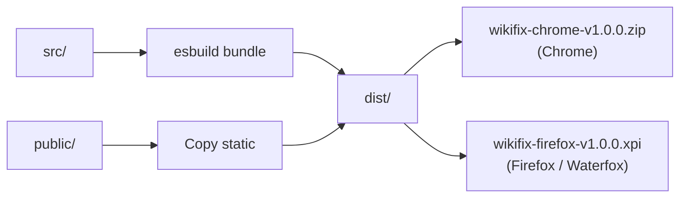

[](https://securityscorecards.dev/viewer/?uri=github.com/Wolren/WikiCitationExtension)
[](https://socket.dev)
[](LICENSE)
[](tsconfig.json)
[](build.mjs)
[](https://vitest.dev)
[](public/manifest.json)
[](public/manifest.json)
[](https://github.com/Wolren/WikiCitationExtension/releases/tag/v1.0.0)

# WikiCitationExtension

A browser extension that finds, cleans, and enriches citations on Wikipedia pages.

The extension runs as a content script on Wikipedia article pages. It scans the page for `<ref>` tags containing `{{cite ...}}` templates, passes them through a configurable pipeline of processing modules, and displays a diff panel for each citation. The user can then apply the changes back to the page's wikitext editor.

---

## Features

### Citation pipeline (10 modules)

| Module | Description |
|---|---|
| Expand | Fills missing fields (title, journal, date) from DOI, PMID, arXiv, ISBN via external APIs |
| Cleanup | Fixes typos, deprecated parameters, invalid ISBNs, empty values; normalizes whitespace (tabs, excess spaces); splits Vancouver-style comma names; resolves CS1 parameter conflicts |
| Dates | Normalizes dates to Wikipedia standard (DD Month YYYY) |
| Authors | Converts between Vancouver and normal author style; optionally enriches names from external APIs; properly cleans up last/first params when generating vauthors |
| CS2toCS1 | Converts `{{citation}}` to its detected template type (`cite journal`, `cite web`, `cite book`, etc.) |
| Enrich IDs | Fetches PMID, PMC, S2CID, QID from DOI; does not overwrite existing fields |
| Sort | Reorders parameters to the Wikipedia citation parameter order |
| Archive | Adds or validates Wayback Machine archive links |
| Dedup | Flags duplicate citations by matching DOI or PMID |
| SFN | Converts inline `<ref>{{cite ...}}</ref>` to `{{sfn}}` short footnotes. Handles named refs, consecutive and multi-param `{{rp}}` (page + loc + at), nested templates, `vauthors`, `author`, and merges sources into existing `== Sources ==` sections |

Each module can be toggled individually from the extension popup.

### CS1 error prevention

The cleanup module addresses these common CS1 errors that Wikipedia's Lua module flags:

| CS1 error | What the extension does |
|---|---|
| More than one of `location` and `place` | `place` is removed when `location` exists |
| More than one of `work` and `website` | `work` is renamed to `website` for `cite web` |
| More than one of author-name-list parameters | `vauthors` is removed when `last` exists; Vancouver mode strips `last`/`first` when creating `vauthors` |
| Vancouver style: name in name N | Comma in `last` field (e.g. `last1=Kretschmer, Ernst`) is split into `last1=Kretschmer` + `first1=Ernst` |
| Both `year` and `date` | `year` is removed when `date` exists |

All checks are verified against live Wikipedia parse API per-citation validation.

### Template-aware parameter mapping

`work` is mapped to the canonical field per template:

| Template | `work` becomes |
|---|---|
| `cite web` | `website` |
| `cite news` | `newspaper` |
| `cite journal` | `journal` |
| `cite magazine` | `magazine` |
| `cite techreport` / `cite patent` | left as `work` (has different meaning) |

`number` is mapped to `issue` only for periodical templates (`cite journal`, `cite magazine`, `cite news`). Other templates keep `number` as-is.

### Spacing presets

Three citation formatting modes, plus whitespace normalization applied by default (tabs to spaces, excess spaces collapsed):

- **Wide** - ` | param = value`
- **Standard** - Wikipedia convention ( `| param = value` )
- **Compact** - `|param=value`

Even without a spacing preset, the cleanup module normalizes tabs and excess whitespace in all output.

### API key configuration

Optional API keys can be set in the popup for higher rate limits:

| Service | Without key | With key |
|---|---|---|
| CrossRef | Polite pool | Priority pool (via email) |
| NCBI / PubMed | 3 req/s | 10 req/s |
| Semantic Scholar | ~1 req/s | 10 req/s |

---

## Architecture


### Build output



### Verification

A diagnostic tool at `tools/diagnose-cs1-errors.ts` validates the extension output against both local parameter checks and the live Wikipedia parse API:

```bash
# Local scan (instant)
npx tsx tools/diagnose-cs1-errors.ts "Article Title" --local

# Hybrid with API spot-check
npx tsx tools/diagnose-cs1-errors.ts "Article Title"
```

Scans for CS1 parameter conflicts per citation across all 7 module configs. See `tools/README.md`.

---

## Installation (development)

### Chrome

1. Run `npm run build`
2. Open `chrome://extensions`
3. Enable Developer mode
4. Click "Load unpacked" and select the `dist/` directory

### Firefox / Waterfox

1. Run `npm run build`
2. Open `about:debugging#/runtime/this-firefox`
3. Click "Load Temporary Add-on" and select `wikifix-extension.xpi`

For permanent installation, sign the `.xpi` through Mozilla Add-ons.

### Prebuilt releases

Grab the latest `.zip` (Chrome) and `.xpi` (Firefox) from:

https://github.com/Wolren/WikiCitationExtension/releases

---

## Release process

```bash
# Bump version in package.json and public/manifest.json
git tag v1.1.0
git push origin v1.1.0
```

The `release.yml` workflow builds, packages both formats, and attaches them to a GitHub Release.

---

## External API dependencies

The extension makes read-only requests to:

- [CrossRef REST API](https://api.crossref.org) - metadata lookup by DOI
- [NCBI E-utilities](https://eutils.ncbi.nlm.nih.gov) - PubMed article metadata
- [Semantic Scholar API](https://api.semanticscholar.org) - paper metadata and citation graph
- [arXiv API](https://export.arxiv.org) - arXiv paper metadata
- [OpenLibrary API](https://openlibrary.org) - ISBN book metadata
- [EuropePMC API](https://www.ebi.ac.uk/europepmc) - article metadata
- [OpenAlex API](https://api.openalex.org) - DOI metadata
- [Wayback Machine API](https://archive.org/wayback) - archive link checking and creation

All requests are made from the browser on behalf of the user's session on Wikipedia.

---

## License

MIT - see [LICENSE](LICENSE).
